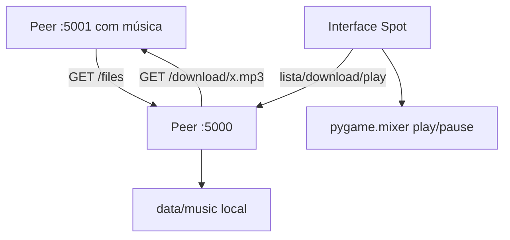

# 🎵 SpotP2P-Music-Player — Player de Música Peer-to-Peer
<p align="center">
  
  <a href="https://github.com/panda12332145/SpotP2P-Music-Player/commits/main"></a>
  <a href="https://github.com/panda12332145/SpotP2P-Music-Player"></a>
  
</p>
---
> 🎵 **Uso ético:** compartilhe apenas músicas que você tem direito de distribuir (ex.: obras próprias, livres ou licenciadas).

---
## 🔖 Resumo

**Player de música descentralizado**: cada nó é ao mesmo tempo **servidor Flask** (expõe `/files` e `/download/<arquivo>`) e **cliente P2P** (descobre peers, baixa músicas para a pasta local). Interface dark **Spot** em customtkinter com lista da rede, download em background e player real (play/pause, anterior, próxima) via `pygame.mixer`. Peer unificado com CLI no terminal.

### ✨ Funcionalidades Principais

- ✅ Peer unificado: `python -m src.peer --port N` (servidor + CLI)
- ✅ Interface **Spot**: lista arquivos da rede, baixa e toca (⏮ ⏯ ⏭)
- ✅ Download automático do primeiro peer que oferecer o arquivo
- ✅ **Proteção contra path traversal** em `/download` (basename + realpath check)
- ✅ Pasta de música na raiz do projeto (`data/music/`) — sem depender do cwd
- ✅ Varredura de `.mp3/.wav/.ogg` + descoberta periódica de peers

## 📽 Demonstração

```text
$ python main.py --port 5001
[+] Peer em http://0.0.0.0:5001 | música: .../data/music
1. Listar arquivos disponíveis
2. Baixar arquivo
3. Sair

$ python player.py        # interface Spot (customtkinter)
```

## ⚙️ Explicação das Partes Importantes

### Download com validação (`src/peer.py`)

```python
safe = os.path.basename(filename)
if safe != filename or not safe:
    return False                      # ../../etc/passwd → recusado
# ...requests.get(f"{peer}/download/{safe}")
```

> O cliente e o servidor validam o nome nos DOIS lados: nem requisição maluca sai, nem arquivo fora da pasta de música entra.

### Rota de download segura

```python
real = os.path.realpath(file_path)
if not real.startswith(os.path.realpath(client.music_dir) + os.sep):
    return "Invalid path", 400        # symlink/bypass bloqueado
```

> `realpath` resolve `..` e links simbólicos antes de servir qualquer byte.

## 🔄 Fluxo de Trabalho / Arquitetura



## 📂 Estrutura do Projeto

```plaintext
SpotP2P-Music-Player/
├── main.py               # peer (servidor + menu CLI)
├── player.py             # interface gráfica Spot
├── src/
│   ├── peer.py           # P2PClient + Flask create_app + CLI
│   └── ui_player.py      # customtkinter + pygame.mixer
├── data/
│   ├── capa.png          # capa do álbum
│   └── music/            # biblioteca local (.mp3 etc)
├── tests/test_peer.py    # 5 testes (peer real em porta efêmera)
├── requirements.txt
└── README.md
```

## 🛠️ Tecnologias

| Ferramenta | Uso |
|---|---|
| **Python 3** | Linguagem |
| **Flask** | API do peer |
| **requests** | Cliente HTTP P2P |
| **pygame.mixer** | Reprodução |
| **customtkinter** | Interface dark |

## ▶️ Instalação

```bash
git clone https://github.com/panda12332145/SpotP2P-Music-Player.git
cd SpotP2P-Music-Player
pip install -r requirements.txt
```

## 🚀 Execução

```bash
# Peer com servidor + menu:
python main.py --port 5001

# Só servidor (para a UI):
python main.py --port 5000 --no-menu

# Interface gráfica (em outra máquina/terminal):
python player.py

# Testes:
python tests/test_peer.py
```

## 🧪 Testes

5 testes automatizados: listagem/download via test_client, bloqueio de path traversal (`..%2F`), varredura por extensão, download REAL entre dois peers em portas efêmeras e import da UI headless.

## ⚠️ Limitações

- Sem enxame DHT — peers são sinalizados manualmente (porta/CLI)
- Descoberta por broadcast manual: adicione IPs conhecidos na rede
- Formatos sujeitos ao suporte do pygame.mixer (mp3/wav/ogg)

## 🚀 Roadmap

- [ ] DHT leve (ex.: mDNS) para descoberta automática
- [ ] Upload pela UI (arrastar arquivo)
- [ ] Barra de progresso real da música
- [ ] Fila de reprodução

## 📄 Licença

Todos os direitos reservados ao autor.

---

## 👾 Autor

<p align="center">
  
</p>

<p align="center">Feito por <strong>Panda12332145</strong> 👋🏽</p>

---

## 🧑‍💻 Sobre Mim

Sou apaixonado por **Física Teórica, Cibersegurança e Desenvolvimento de Sistemas**. Tenho grande interesse em programação de baixo nível, engenharia reversa, automação, sistemas Windows, criptografia e segurança ofensiva. Também gosto bastante de música, filosofia e computação avançada.

---

## 🌐 Redes

* **Site:** [https://panda-h0me.netlify.app/](https://panda-h0me.netlify.app/)
* **YouTube:** [https://www.youtube.com/@X86BinaryGhost](https://www.youtube.com/@X86BinaryGhost)
* **Instagram:** [https://www.instagram.com/01pandal10/](https://www.instagram.com/01pandal10/)
* **GitHub:** [https://github.com/panda12332145](https://github.com/panda12332145)
* **LinkedIn:** [linkedin.com/in/athos-da-boanergis](https://www.linkedin.com/in/athos-d%C3%A3-boanergis-5585a4288/)

---

## 🚀 Áreas de Interesse

* **Cibersegurança Avançada** 🔒
* **Hacking & Engenharia Reversa** 💻
* **Computação de Baixo Nível** 🖥️
* **Matemática e Física Teórica** 📐⚛️
* **Desenvolvimento de Ferramentas de Segurança** 🛠️

_"Conhecimento é poder, e domínio técnico vem da compreensão profunda dos sistemas."_

---

## 📞 Contato & Suporte

Para colaborações, dúvidas ou sugestões:

📧 **E-mail:** [athos.cybersec@gmail.com](mailto:athos.cybersec@gmail.com)

🐛 **Reportar Bug:** [Abrir Issue](https://github.com/panda12332145/SpotP2P-Music-Player/issues)

💡 **Sugerir Melhoria:** [Discussions](https://github.com/panda12332145/SpotP2P-Music-Player/discussions)
